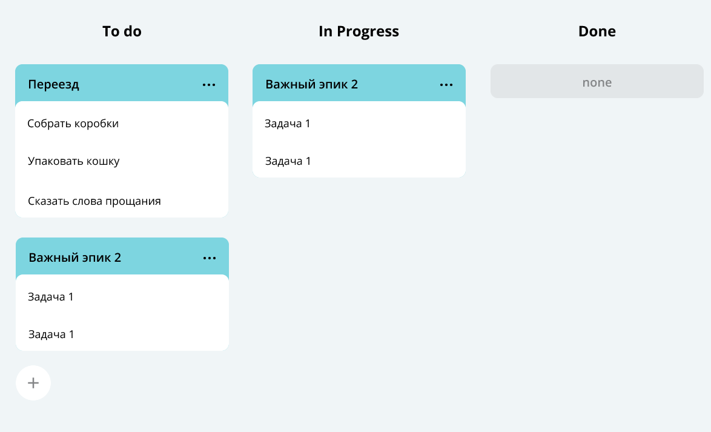
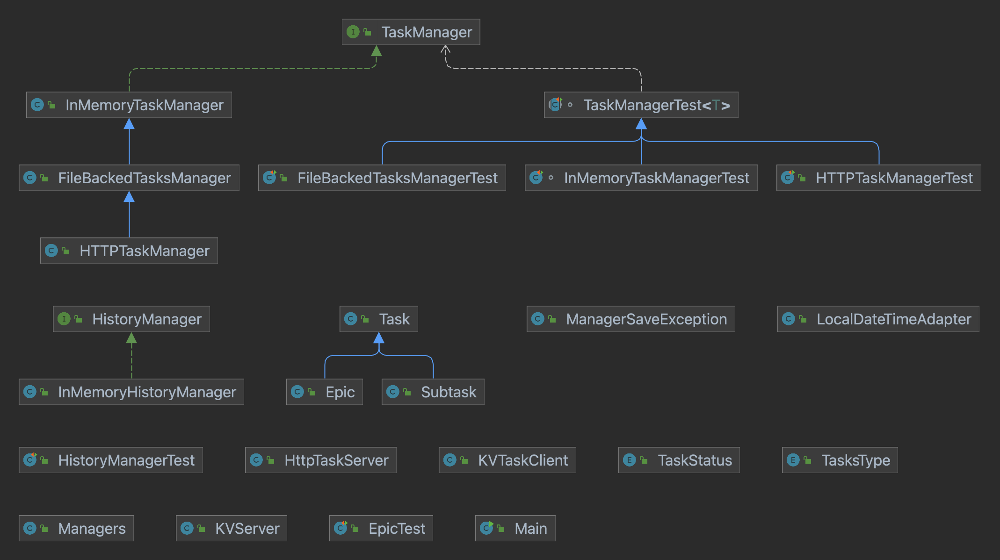

## Task tracker backend
Just as version control systems help a team work on shared code, issue trackers allow you to efficiently collaborate on issues. 
____
#### This is the program responsible for generating the data model for this page:

In our system, tasks can be of three types: normal tasks, epics (large tasks that are divided into subtasks) and subtasks. The following conditions are met for them:
1) For each subtask, it is known within which epic it is performed.
2) Each epic knows what subtasks it includes.
3) Completion of all subtasks of an epic is considered the completion of an epic.
____
####   Task tracker features:
* The application can prioritize tasks and check if they overlap in execution time
* The tracker displays the last tasks viewed by the user (at the same time, the task viewing time does not depend on the total number of tasks in the history thanks to CustomLinkedList)
* Two managers differ in the implementation details of the methods: one stores information in RAM, the other saves the current state of the manager to the specified CSV file and restores the manager's data from the file when the program starts
* Each public method is checked by JUnit tests
* The application also implements an HTTP client. With its help, we moved the storage of the manager's state from files to a separate server (KVServer).
